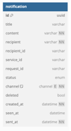

# Notifications service

## Documentation
- [Configuration](./doc/configuration/config.md)
- [Workflows](./doc/workflows/workflows.md)

## Summary

The Notifications Service is responsible for managing and delivering various types of notifications within the system.
It provides a unified interface for sending alerts to users through multiple channels such as <b>email</b>, <b>SMS</b>, <b>in-app messages</b> or <b>Whatsapp messages</b>.

The Notifications Service is a queue-based system, offering full configurability. 
It supports asynchronous notification processing, either through Kafka or via REST API calls, allowing flexibility in how notifications are populated and managed.
Besides that services provides resources for notifications management.

With the use of JVM virtual threads, the service can process notifications for each recipient concurrently, scaling to millions of users as provided memory and system resources can support it. The service ensures that notifications are delivered to users in the correct order.

### Channels
- Email
- SMS
- Whatsapp
- Internal notifications (<i>Currently in-app messages are not provided in real time</i>)

### Communication
- Kafka
- REST

### Customization
Serivce
To enable or features please provide `spring.profile.active` property with proper profiles. The list can be found in configuration documentation.

### Storage
Service is using MongoDB as a storage of notification history.

## Development
- Locally
    - Compile the jar (`mvn package` or `mvn clean install`)
    - Fill up config file according to the documentation
    - Bring up the database `docker compose up -d mongo --build`
    - Run `java --jar target/notifications.jar --Dspring.additional-config.location=config/config-dev.yml`
- With Docker
    - Compile the jar (`mvn package` or `mvn clean install`)
    - Fill up config file according to the documentation
    - Copy the file `docker/.env.dist` to `docker/.env` and propagate it with data
    - Bring up the database `docker compose up -d --build`

